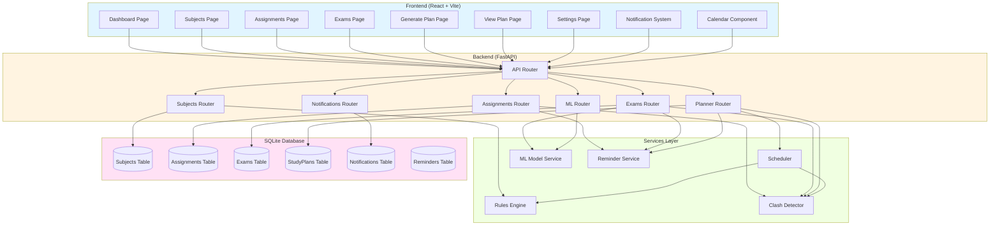
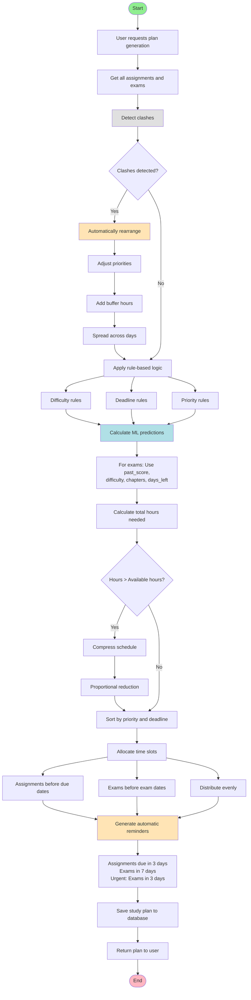
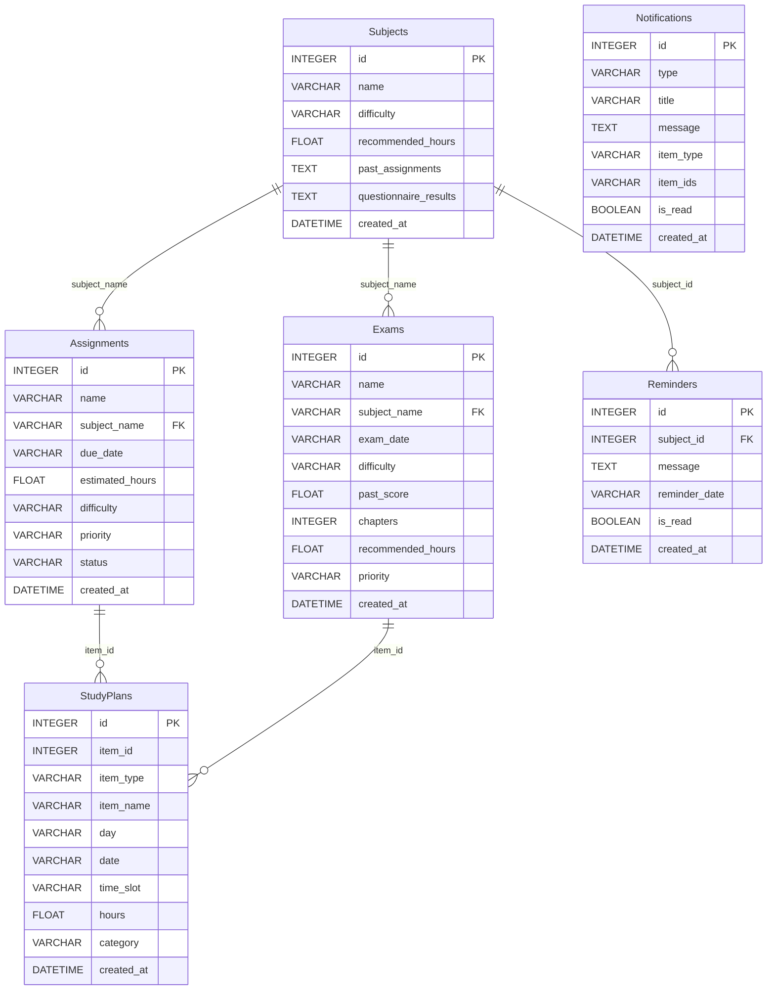
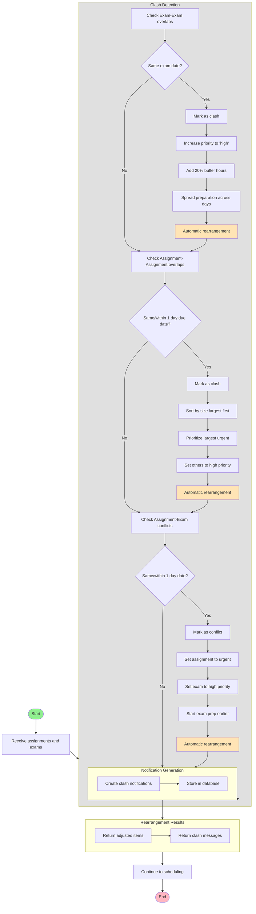
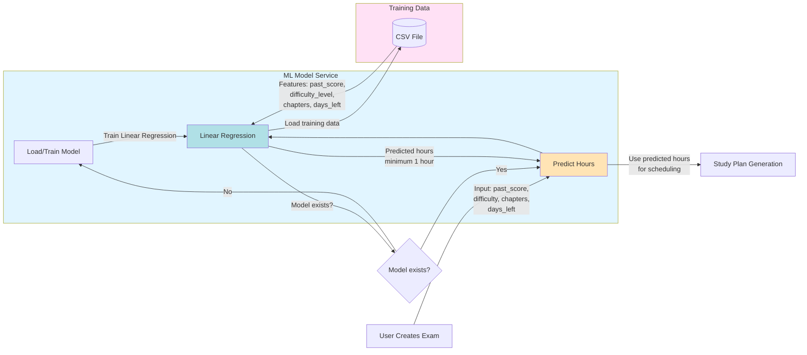

# Mermaid Diagrams for Intelligent Study Planner

This file contains all diagrams from the report in Mermaid format. These diagrams can be rendered in:
- GitHub (native support)
- VS Code (with Mermaid extension)
- Online editors: [Mermaid Live Editor](https://mermaid.live/)
- Documentation tools like MkDocs, GitBook, etc.

---

## 1. System Architecture Diagram

This diagram visualizes the system architecture showing frontend, backend, services, and database layers.

---

## 2. Study Plan Generation Flow Diagram

This flowchart illustrates how study plans are generated with automatic clash detection and rearrangement.

---

## 3. Database Schema Diagram (ER Diagram)

This ER diagram shows the database structure and relationships between all tables.

**Notes:**
- Assignments and Exams are linked to Subjects via `subject_name` (not FK constraint)
- Exams use ML-predicted `recommended_hours`
- StudyPlans `item_type` and `category` are either "assignment" or "exam"

---

## 4. Clash Detection and Rearrangement Flow

This flowchart details the clash detection and automatic rearrangement process.

---

## 5. ML Model Prediction Flow

This diagram shows how the ML model predicts study hours based on exam features.

**ML Model Details:**
- **Features:**
  - `past_score` (0-100)
  - `difficulty_level` (0,1,2)
  - `chapters` (integer)
  - `days_left` (integer)
- **Output:**
  - `recommended_hours` (float, minimum 1 hour)

---

## How to Use These Mermaid Diagrams

### GitHub
Simply paste the code blocks into any `.md` file in your GitHub repository. GitHub will automatically render them.

### VS Code
1. Install the "Markdown Preview Mermaid Support" extension
2. Open the markdown file
3. Use the preview feature to see rendered diagrams

### Online Editors
1. Go to [Mermaid Live Editor](https://mermaid.live/)
2. Copy any diagram code
3. Paste into the editor
4. Export as PNG, SVG, or copy the link

### Documentation Tools
- **MkDocs**: Use `mkdocs-mermaid2-plugin`
- **GitBook**: Native support
- **Docusaurus**: Use `@docusaurus/theme-mermaid`
- **Notion**: Copy rendered images
- **Confluence**: Use Mermaid macro

---

## Diagram Summary

1. **System Architecture Diagram**: Shows the complete system architecture with frontend, backend, services, and database layers
2. **Study Plan Generation Flow**: Illustrates the step-by-step process of generating study plans with clash detection and ML predictions
3. **Database Schema (ER Diagram)**: Displays all database tables and their relationships
4. **Clash Detection Flow**: Details the automatic clash detection and rearrangement algorithm
5. **ML Model Prediction Flow**: Shows how the machine learning model predicts study hours

All diagrams have been converted from PlantUML to Mermaid format for better compatibility with modern documentation platforms and tools.

