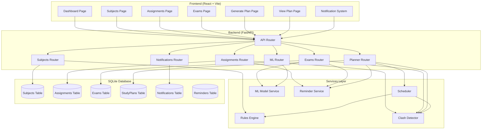
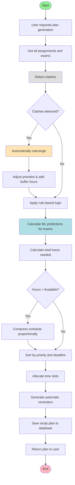

# Intelligent Study Planner - Project Report

## Problem Addressed

Students struggle with managing study schedules effectively when dealing with multiple subjects, varying difficulty levels, and tight deadlines. The main challenges are:

1. **Time Management**: Allocating appropriate study time based on difficulty, past performance, and exam proximity
2. **Clash Detection**: Identifying and resolving scheduling conflicts (overlapping exams, assignments, insufficient time)
3. **Priority Management**: Determining which subjects need immediate attention based on deadlines and performance history
4. **Adaptive Scheduling**: Creating flexible study plans that can be adjusted based on changing circumstances
5. **Real-time Notifications**: Being informed immediately about scheduling conflicts and important deadlines

Traditional study planners lack intelligence to automatically optimize schedules, requiring manual intervention and often resulting in suboptimal time allocation.

## Approach

This project implements an **Intelligent Study Planner** that combines rule-based logic, machine learning, and intelligent algorithms:

### 1. Rule-Based Logic Engine
Implements 15+ rules that automatically adjust study recommendations based on:
- Subject difficulty (easy, medium, hard)
- Exam proximity (days until exam)
- Past performance scores
- Assignment and exam conflicts
- Number of chapters

**Key Rules:**
- Hard difficulty → +2 hours
- Exam within 3 days → urgent priority
- Past score < 40 → +2 hours
- Past score > 75 → -1 hour
- Many chapters (>10) → +1 hour

### 2. Machine Learning Model
A **Linear Regression** model predicts recommended study hours based on:
- `past_score` (0-100): Previous performance
- `difficulty_level` (easy=0, medium=1, hard=2)
- `chapters`: Number of chapters to cover
- `days_left`: Days until exam

The model is trained on historical data and continuously improves with more examples.

### 3. Intelligent Scheduler
Automatically:
- Detects clashes (overlapping exams, assignments, assignment-exam conflicts)
- Rearranges study slots when clashes are detected
- Prioritizes items based on urgency and category
- Uses estimated hours for assignments and ML-predicted hours for exams
- Distributes study load evenly across available days

### 4. Clash Detection & Rearrangement
When overlaps are detected, the system automatically:
- Increases priority of conflicting items
- Adds buffer time (20% increase for exam conflicts)
- Spreads preparation across multiple days
- Prioritizes assignments over exams in conflicts

### 5. Automatic Reminders
Generates reminders for:
- Assignments due within 3 days
- Exams within 7 days (urgent for exams within 3 days)
- Triggered automatically when items are created/updated or plans are generated

### 6. Flexible Rescheduling
Users can regenerate plans anytime with different parameters:
- Adjust available hours per day
- Change start dates
- Automatic clash resolution during rescheduling

## Implementation Details

### Architecture

The application follows a **3-tier architecture**:
- **Frontend**: React (with Vite) for modern, responsive UI
- **Backend**: FastAPI (Python) for RESTful API
- **Database**: SQLite for lightweight, file-based storage

### System Architecture

### Backend Components

#### Database Models
- **Subject**: Stores subject information (name, difficulty, recommended hours)
- **Assignment**: Stores assignment details (due date, estimated hours, priority)
- **Exam**: Stores exam information (exam date, past score, chapters, ML-predicted hours)
- **StudyPlan**: Stores generated study schedules with time slots
- **Notification**: Stores clash notifications and alerts
- **Reminder**: Stores reminder messages for upcoming deadlines

#### Core Services

**1. Rules Engine** (`app/services/rules_engine.py`)
- Implements 15+ intelligent rules for scheduling optimization
- Adjusts study hours based on difficulty, deadlines, and performance
- Automatically sets priorities based on urgency

**2. Clash Detector** (`app/services/clash_detector.py`)
- Detects Assignment-Assignment overlaps (same due date or within 1 day)
- Detects Exam-Exam overlaps (same exam date)
- Detects Assignment-Exam conflicts (same date or within 1 day)
- Automatically creates notifications for all detected clashes

**3. Scheduler** (`app/services/scheduler.py`)
- **Automatic Clash Rearrangement**: When clashes are detected, automatically:
  - Adjusts priorities (urgent for assignments in conflicts, high for exams)
  - Adds 20% buffer hours for exam conflicts
  - Spreads preparation across multiple days
- Combines assignments and exams into unified schedule
- Allocates time slots based on user availability
- Distributes study load evenly
- Deadline-aware scheduling (assignments before due dates, exams before exam dates)

**4. ML Model Service** (`app/services/ml_model.py`)
- Trains Linear Regression model on historical data
- Predicts recommended study hours based on past performance
- Features: past_score, difficulty_level, chapters, days_left
- Returns minimum 1 hour guarantee

**5. Reminder Service** (`app/services/reminder_service.py`)
- Automatically generates reminders for upcoming deadlines
- Assignments due within 3 days
- Exams within 7 days (urgent for 3 days)

### Study Plan Generation Flow

### Key API Endpoints

**Planner API** (`/api/planner`):
- `POST /generate`: Generate study plan (triggers clash detection, ML predictions, reminders)
- `GET /weekly`: Get weekly study plan
- `DELETE /clear`: Clear all plans

**Exams API** (`/api/exams`):
- `POST /`: Create exam with ML prediction
- All CRUD operations trigger clash detection and reminder generation

**Assignments API** (`/api/assignments`):
- `POST /`: Create assignment (triggers clash detection)
- All CRUD operations trigger automatic reminder generation

### Frontend Implementation

**Pages:**
- **Dashboard**: Overview with statistics and reminders
- **AddSubjects/Assignments/Exams**: Management pages for each entity type
- **GeneratePlan**: Plan generation with parameter input
- **ViewPlan**: Calendar view with daily/weekly/monthly modes

**Components:**
- **NotificationIcon**: Real-time notification bell with unread count
- **ReminderBanner**: Displays active reminders
- **Calendar**: Interactive calendar with multiple view modes
- **Forms**: SubjectForm, AssignmentForm, ExamForm for data input

**Features:**
- Real-time notification polling (every 30 seconds)
- Automatic clash detection alerts
- One-click rescheduling
- Responsive design for mobile and desktop

### Technical Stack

**Backend:**
- FastAPI (Python web framework)
- SQLAlchemy (ORM)
- SQLite (Database)
- scikit-learn (Machine learning)
- pandas (Data manipulation)

**Frontend:**
- React 18 (UI library)
- React Router (Navigation)
- Vite (Build tool)
- Axios (HTTP client)

## Key Achievements

1. **Automatic Clash Detection & Rearrangement**: System detects overlaps and automatically rearranges study slots without manual intervention
2. **ML-Based Predictions**: Predicts optimal study time based on past performance using Linear Regression
3. **Rule-Based Optimization**: 15+ intelligent rules automatically adjust schedules
4. **Real-time Notifications**: Immediate alerts for conflicts and upcoming deadlines
5. **Flexible Rescheduling**: Easy plan regeneration with automatic conflict resolution

The implementation successfully combines rule-based logic, machine learning, and intelligent algorithms to provide an automated, intelligent study planning solution.
