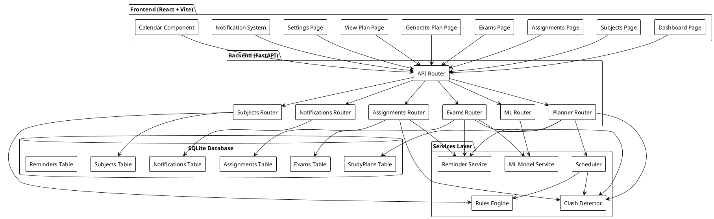
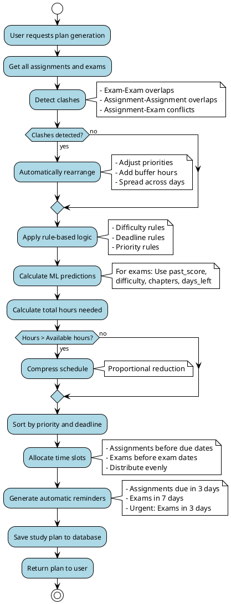
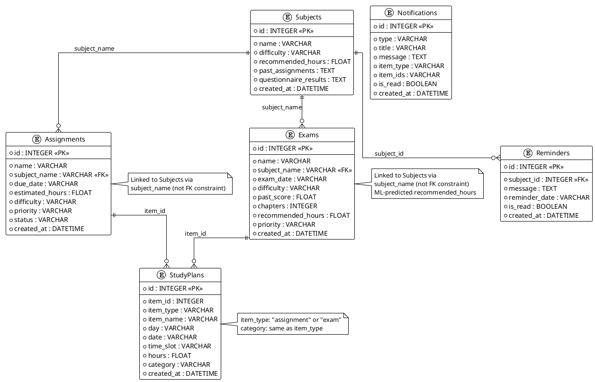
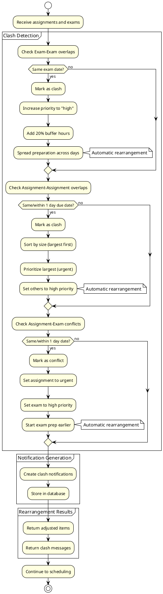

# Intelligent Study Planner - Project Report

## Scenario Requirements Implementation

This application fully implements **Scenario 02: Intelligent Study Planner** with the following requirements:

### ✅ 1. Rule-Based Logic to Detect Clashes and Rearrange Study Slots

**Implementation:** The system uses comprehensive rule-based logic to automatically detect and resolve clashes:

- **Automatic Clash Detection** (`app/services/clash_detector.py`):
  - Detects overlapping exams (same exam date)
  - Detects overlapping assignments (same due date or within 1 day)
  - Detects assignment-exam conflicts (same date or within 1 day)

- **Automatic Rearrangement** (`app/services/scheduler.py`):
  - When overlapping exams are detected, the scheduler automatically rearranges study slots by:
    - Increasing priority of conflicting items
    - Distributing study hours more evenly across available dates
    - Adding buffer time (20% increase) to allow for earlier preparation
    - Spreading preparation across multiple days to avoid conflicts
  - When assignment-exam conflicts occur, assignments are prioritized (urgent) and exam preparation is scheduled earlier
  - The rearrangement happens automatically during plan generation - no manual intervention required

**Example:** If two exams are scheduled on the same date, the system automatically detects this clash and rearranges the study schedule to start preparing for both exams earlier, distributing study time across multiple days before the exam date.

### ✅ 2. Simple ML Model to Predict Study Time Based on Past Performance

**Implementation:** A Linear Regression model (`app/services/ml_model.py`) predicts recommended study hours:

- **Features Used:**
  - `past_score` (0-100): Previous performance score
  - `difficulty_level` (easy=0, medium=1, hard=2): Subject difficulty
  - `chapters`: Number of chapters to cover
  - `days_left`: Days until exam

- **Training Data:** Sample dataset with 15 examples, expandable with real user data
- **Prediction:** Returns recommended study hours (minimum 1 hour)
- **Integration:** Automatically used when creating/updating exams via the API
- **Continuous Improvement:** Model can be retrained with more data over time

**Example:** For an exam with past_score=65, difficulty="hard", chapters=10, and days_left=7, the ML model predicts approximately 4-5 hours of recommended study time, which is then used in the study plan.

### ✅ 3. Reminders and Flexible Rescheduling Mechanisms

**Implementation:**

- **Automatic Reminder Generation** (`app/services/reminder_service.py`):
  - Automatically creates reminders for assignments due within 3 days
  - Automatically creates reminders for exams within 7 days (urgent reminders for exams within 3 days)
  - Reminders are generated automatically when:
    - Assignments/exams are created or updated
    - Study plans are generated
  - Reminders displayed in a banner on the dashboard and in notification system

- **Flexible Rescheduling Mechanisms:**
  - **Easy Rescheduling:** Users can regenerate study plans at any time from the "Generate Plan" page
  - **Dynamic Parameters:** Users can adjust:
    - Available hours per day
    - Start date
    - End date (auto-calculated from latest deadline)
  - **One-Click Rescheduling:** "Reschedule Plan" button in View Plan page for quick regeneration
  - **Automatic Clash Resolution:** When rescheduling, clashes are automatically detected and resolved
  - **Preserves Data:** Existing assignments and exams remain unchanged during rescheduling

**Example:** A student can change their available hours from 3 to 5 hours per day and instantly regenerate their entire study plan. The system will automatically detect any new clashes, rearrange study slots, and update reminders.

## Problem Addressed

Students often struggle with managing their study schedules effectively, especially when dealing with multiple subjects, varying difficulty levels, and tight deadlines. The challenge lies in:

1. **Time Management**: Allocating appropriate study time for each subject based on difficulty, past performance, and exam proximity
2. **Clash Detection**: Identifying and resolving scheduling conflicts (e.g., overlapping exams, overlapping assignments, assignment-exam conflicts, insufficient time allocation)
3. **Priority Management**: Determining which subjects need immediate attention based on deadlines and performance history
4. **Adaptive Scheduling**: Creating flexible study plans that can be adjusted based on changing circumstances
5. **Assignment Management**: Tracking assignments separately from exams with estimated completion times
6. **Real-time Notifications**: Being informed immediately about scheduling conflicts and important deadlines

Traditional study planners lack the intelligence to automatically optimize schedules based on multiple factors, requiring manual intervention and often resulting in suboptimal time allocation. Additionally, they fail to distinguish between assignments and exams, which have different time allocation requirements.

## Approach

This project implements an **Intelligent Study Planner** that combines:

1. **Rule-Based Logic Engine**: A comprehensive set of 15+ rules that automatically adjust study recommendations based on:
   - Subject difficulty (easy, medium, hard)
   - Exam proximity (days until exam)
   - Past performance scores
   - Assignment and exam conflicts
   - Study history (hours studied last week)
   - Number of chapters

2. **Machine Learning Model**: A Linear Regression model that predicts recommended study hours based on:
   - Past score (0-100)
   - Difficulty level (easy=0, medium=1, hard=2)
   - Number of chapters
   - Days left until exam

3. **Intelligent Scheduler**: An algorithm that:
   - Detects clashes (overlapping exams, assignments, and assignment-exam conflicts)
   - Prioritizes items based on urgency and category
   - Allocates time slots efficiently for both assignments and exams
   - Uses estimated hours for assignments and ML-predicted hours for exams
   - Compresses schedules when needed
   - Distributes study load evenly
   - Categorizes study plan items (assignment vs exam)

4. **Comprehensive Clash Detection System**: Automatically detects and notifies users about:
   - Assignment-Assignment overlaps (same due date or within 1 day)
   - Exam-Exam overlaps (same exam date)
   - Assignment-Exam conflicts (same date or within 1 day)

5. **Real-time Notification System**: 
   - Notification icon with unread count badge
   - Automatic clash detection on create/update/delete
   - Dropdown notification panel
   - Mark as read functionality

6. **Interactive Interface**: A modern web application that allows users to:
   - Add and manage subjects, assignments, and exams separately
   - Specify estimated hours for assignments
   - Generate optimized study plans with category distinction
   - View weekly schedules with assignment/exam categories
   - Receive real-time notifications about conflicts
   - Interact via command interface

## Implementation Details

### Architecture

The application follows a **MERN-style architecture** with:

- **Frontend**: React (with Vite) for modern, responsive UI
- **Backend**: FastAPI (Python) for RESTful API
- **Database**: SQLite for lightweight, file-based storage

#### System Architecture Diagram

The following diagram can be used on [PlantText.com](https://www.planttext.com/) to visualize the system architecture:



#### Study Plan Generation Flow Diagram

This diagram illustrates how study plans are generated with automatic clash detection and rearrangement:



#### Database Schema Diagram (ER Diagram)

This diagram shows the database structure and relationships:



#### Clash Detection and Rearrangement Flow

This diagram details the clash detection and automatic rearrangement process:



#### ML Model Prediction Flow

This diagram shows how the ML model predicts study hours:

```plantuml
@startuml ML Model Flow
!theme plain
skinparam componentStyle rectangle

package "ML Model Service" {
  [Load/Train Model] as TrainModel
  [Linear Regression] as Model
  [Predict Hours] as Predict
}

database "Training Data" {
  [CSV File] as TrainingData
}

[User Creates Exam] as CreateExam

CreateExam --> Predict : "Input: past_score,\ndifficulty, chapters,\ndays_left"

Predict --> Model

Model --> TrainingData : "Load training data"
TrainingData --> Model : "Features: past_score,\ndifficulty_level,\nchapters, days_left"

if (Model exists?) then (no)
  TrainModel --> Model : "Train Linear Regression"
end if

Model --> Predict : "Predicted hours\n(minimum 1 hour)"

Predict --> [Study Plan Generation] : "Use predicted hours\nfor scheduling"

note right of Model
  Features:
  - past_score (0-100)
  - difficulty_level (0,1,2)
  - chapters (integer)
  - days_left (integer)
  
  Output:
  - recommended_hours (float)
end note

@enduml
```

### Backend Implementation

#### 1. Database Models (`app/models/database.py`)

Six main models:
- **Subject**: Stores simplified subject information (name, difficulty, recommended hours, past assignments, questionnaire results)
- **Assignment**: Stores assignment information (name, subject_name from dropdown, due date, estimated hours, difficulty, status)
- **Exam**: Stores exam information (name, subject_name from dropdown, exam date, difficulty, past score, chapters, recommended hours)
- **StudyPlan**: Stores generated study schedules (day, time slot, item_id, item_type, category, hours, subject_name)
- **Notification**: Stores clash notifications and reminders (type, title, message, item_type, item_ids, is_read)
- **Reminder**: Stores reminders for upcoming exams and deadlines

#### 2. Rules Engine (`app/services/rules_engine.py`)

Implements 15 intelligent rules:

1. **Hard difficulty → +2 hours**: Hard subjects require more study time
2. **Medium difficulty → +1 hour**: Medium subjects get moderate boost
3. **Exam within 3 days → urgent priority**: Immediate attention needed
4. **Exam within 7 days → high priority**: High priority scheduling
5. **Past score < 40 → +2 hours**: Low performers need extra time
6. **Past score > 75 → -1 hour**: High performers need less time
7. **Assignment + exam → +1 hour**: Combined workload increases time
8. **Not studied last week → +1 hour**: Catch-up time needed
9. **Minimum 1 hour rule**: Ensure at least 1 hour per subject
10. **Many chapters (>10) → +1 hour**: More content requires more time
11. **Easy + good score → -0.5 hour**: Reduce time for easy subjects with good scores
12. **Hard + low score → +3 hours**: Significant boost for struggling students
13. **Exam > 30 days away → low priority**: Distant exams get lower priority
14. **Auto-set priority**: Automatically assign priority if missing
15. **Cap at 8 hours max**: Prevent unrealistic daily allocations

**Clash Detection** (Enhanced in `app/services/clash_detector.py`):
- Detects Assignment-Assignment overlaps (same due date or within 1 day)
- Detects Exam-Exam overlaps (same exam date)
- Detects Assignment-Exam conflicts (same date or within 1 day)
- Automatically creates notifications for all detected clashes
- Prevents duplicate notifications
- Provides detailed clash summaries

**Automatic Reminder Generation** (`app/services/reminder_service.py`):
- Automatically generates reminders for assignments due within 3 days
- Automatically generates reminders for exams within 7 days
- Creates urgent reminders (⚠️) for exams within 3 days
- Triggered automatically when:
  - Assignments/exams are created or updated
  - Study plans are generated
- Reminders are stored in database and displayed in:
  - Reminder banner on dashboard
  - Notification system
- Prevents duplicate reminders

#### 3. ML Model (`app/services/ml_model.py`)

**Model Type**: Linear Regression

**Features**:
- `past_score`: Previous performance (0-100)
- `difficulty_level`: Numeric encoding (easy=0, medium=1, hard=2)
- `chapters`: Number of chapters to cover
- `days_left`: Days until exam

**Training Data**: 
- Sample dataset with 15 examples
- Can be extended with real user data
- Automatically creates training data if file doesn't exist

**Prediction**:
- Returns recommended study hours (minimum 1 hour)
- Used when creating/updating subjects
- Continuously improves with more training data

#### 4. Enhanced Scheduler (`app/services/scheduler.py`)

**Algorithm with Automatic Clash Rearrangement**:
1. **Detect and Handle Clashes** (`detect_and_handle_clashes` function):
   - Identifies overlapping exams (same exam date)
   - Identifies overlapping assignments (same due date or within 1 day)
   - Identifies assignment-exam conflicts (same date or within 1 day)
   - **Automatically rearranges** by adjusting priorities and distributing study hours
   - For exam-exam clashes: Increases priority to "high", adds 20% buffer hours, spreads preparation across days
   - For assignment-assignment clashes: Prioritizes larger assignments, adjusts priorities dynamically
   - For assignment-exam conflicts: Prioritizes assignments (urgent), starts exam preparation earlier (high priority)
2. Combine assignments and exams into unified item list with clash adjustments
3. Apply rules for assignments (due date proximity, estimated hours)
4. Apply rules for exams (exam date proximity, ML-predicted hours)
5. Calculate total hours needed (assignments use estimated_hours, exams use recommended_hours)
6. Compress schedule if needed (proportional reduction)
7. Sort items by priority (urgent > high > medium > low) and due date
8. Allocate time slots (1-hour blocks starting at 9 AM)
9. Distribute items across available days with category tracking
10. Generate weekly plan with day-by-day breakdown including category

**Features**:
- **Automatic Clash Detection and Rearrangement**: Detects overlaps and automatically rearranges study slots
- Handles assignments separately from exams
- Uses estimated hours for assignments (user-provided)
- Uses ML-predicted hours for exams
- Includes category column (assignment/exam) in study plans
- Handles insufficient time by compressing schedules
- Prioritizes urgent items based on due dates
- Distributes study load evenly
- Creates time slots based on user availability
- Tracks subject names for both assignments and exams
- **Rule-based rearrangement**: When clashes detected, automatically adjusts priorities and spreads workload

**New Rules for Assignments**:
- Assignment due within 3 days → urgent priority
- Large assignment (>10 hours) → high priority
- Small assignment (<2 hours) → flexible scheduling

**New Rules for Exams**:
- Exam within 3 days → urgent priority
- Exam within 7 days → high priority

#### 5. API Endpoints

**Subjects API** (`/api/subjects`):
- `POST /`: Create new subject (simplified: name, difficulty, past_assignments, questionnaire_results)
- `GET /`: Get all subjects
- `GET /{id}`: Get specific subject
- `PUT /{id}`: Update subject
- `DELETE /{id}`: Delete subject
- `GET /reminders/active`: Get active reminders

**Note**: Subjects are now simplified to store only essential information. Recommended hours are calculated based on difficulty (easy: 2h, medium: 4h, hard: 6h). Assignments and exams are linked to subjects via subject_name dropdown selection.

**Assignments API** (`/api/assignments`):
- `POST /`: Create new assignment (triggers clash detection)
- `GET /`: Get all assignments
- `GET /{id}`: Get specific assignment
- `PUT /{id}`: Update assignment (triggers clash detection)
- `DELETE /{id}`: Delete assignment (triggers clash detection)

**Exams API** (`/api/exams`):
- `POST /`: Create new exam (with ML prediction, triggers clash detection)
- `GET /`: Get all exams
- `GET /{id}`: Get specific exam
- `PUT /{id}`: Update exam (triggers clash detection)
- `DELETE /{id}`: Delete exam (triggers clash detection)

**Notifications API** (`/api/notifications`):
- `GET /`: Get all notifications (optional: unread_only parameter)
- `GET /unread/count`: Get count of unread notifications
- `POST /{id}/read`: Mark notification as read
- `POST /read-all`: Mark all notifications as read
- `DELETE /{id}`: Delete notification
- `POST /detect-clashes`: Manually trigger clash detection

**Planner API** (`/api/planner`):
- `POST /generate`: Generate study plan (uses assignments and exams)
- `GET /weekly`: Get weekly study plan (includes category column)
- `DELETE /clear`: Clear all plans

**ML API** (`/api/ml`):
- `POST /train`: Train the ML model
- `POST /predict`: Predict study hours for given inputs

### Frontend Implementation

#### 1. Components

- **Navbar**: Navigation between pages with notification icon
- **NotificationIcon**: Notification bell icon with unread count badge and dropdown panel
- **SubjectForm**: Simplified form for adding/editing subjects (name, difficulty, past assignments, questionnaire results)
- **AssignmentForm**: Form for adding/editing assignments (includes subject dropdown, estimated hours field, and relevant assignment questions)
- **ExamForm**: Form for adding/editing exams (includes subject dropdown and relevant exam questions)
- **StudyPlanTable**: Displays weekly study schedule with category column
- **ReminderBanner**: Shows active reminders
- **Loader**: Loading indicator

#### 2. Pages

- **Dashboard**: Overview with statistics and recent subjects
- **AddSubjects**: Simplified subject management (shows: name, difficulty, recommended hours, past assignments, questionnaire results)
- **AddAssignments**: Manage assignments (add, view, delete) with subject dropdown and estimated hours
- **AddExams**: Manage exams (add, view, delete) with subject dropdown
- **GeneratePlan**: Generate new study plans (includes assignments and exams)
- **ViewPlan**: View current study schedule with category distinction
- **Settings**: ML model training and command interface info

#### 3. Interactive Command Interface

The Settings page provides a command interface where users can:
- `add subject`: Navigate to add subjects page
- `generate plan`: Generate a new study schedule
- `view plan`: View current schedule
- `clear plan`: Clear existing plan

Commands are implemented as navigation actions and button clicks in the UI.

#### 4. API Integration

- Custom hooks (`useFetch`, `usePost`, `useDelete`) for API calls
- Centralized API modules (`subjects.js`, `assignments.js`, `exams.js`, `notifications.js`, `plan.js`, `ml.js`)
- Error handling and loading states
- Automatic data refresh
- Real-time notification polling (every 30 seconds)

#### 5. Notification System

- **Notification Icon**: Bell icon in navbar with unread count badge
- **Dropdown Panel**: Shows all unread notifications with:
  - Notification type icons (clash, reminder, warning)
  - Title and message for each notification
  - Click to mark as read
  - "Mark all read" functionality
- **Auto-refresh**: Checks for new notifications every 30 seconds
- **Visual Indicators**: Color-coded notifications by type

### Key Features

1. **AI-Powered Recommendations**: ML model predicts optimal study hours for exams
2. **Rule-Based Optimization**: 15+ rules automatically adjust schedules
3. **Comprehensive Clash Detection**: 
   - Detects Assignment-Assignment overlaps
   - Detects Exam-Exam overlaps
   - Detects Assignment-Exam conflicts
   - Automatic notification generation
4. **Real-time Notification System**: 
   - Notification icon with unread count
   - Dropdown panel with all notifications
   - Auto-refresh every 30 seconds
   - Mark as read functionality
5. **Separate Assignment and Exam Management**: 
   - Dedicated pages for assignments and exams
   - Estimated hours for assignments (user-provided)
   - ML-predicted hours for exams
6. **Category-based Study Plans**: 
   - Study plans show category (assignment/exam)
   - Different time allocation strategies
   - Clear distinction in weekly view
7. **Priority Management**: Automatically prioritizes based on deadlines and urgency
8. **Flexible Rescheduling**: Easy to regenerate plans with new parameters
9. **Reminders**: Active reminders for upcoming exams and assignments
10. **Responsive UI**: Modern, mobile-friendly interface
11. **Real-time Updates**: Automatic refresh of data and notifications

## Technical Stack

### Backend
- **FastAPI**: Modern Python web framework
- **SQLAlchemy**: ORM for database operations
- **SQLite**: Lightweight database
- **scikit-learn**: Machine learning library
- **pandas**: Data manipulation
- **Pydantic**: Data validation

### Frontend
- **React 18**: UI library
- **React Router**: Navigation
- **Vite**: Build tool and dev server
- **Axios**: HTTP client
- **CSS3**: Styling with modern gradients and animations

## Database Schema

### Subjects Table
- `id`: Primary key
- `name`: Subject name
- `difficulty`: easy/medium/hard
- `recommended_hours`: Calculated based on difficulty (easy: 2h, medium: 4h, hard: 6h)
- `past_assignments`: Text field for past assignment information
- `questionnaire_results`: Text field for questionnaire/assessment results
- `created_at`: Timestamp

**Note**: Subjects are simplified to focus on core information. Assignments and exams are managed separately and linked via subject_name.

### Assignments Table
- `id`: Primary key
- `name`: Assignment name
- `subject_name`: Subject name
- `due_date`: Due date (YYYY-MM-DD)
- `estimated_hours`: User-estimated hours needed
- `difficulty`: easy/medium/hard
- `priority`: urgent/high/medium/low (auto-calculated)
- `status`: pending/in_progress/completed
- `created_at`: Timestamp

### Exams Table
- `id`: Primary key
- `name`: Exam name
- `subject_name`: Subject name
- `exam_date`: Exam date (YYYY-MM-DD)
- `difficulty`: easy/medium/hard
- `past_score`: Previous score (0-100)
- `chapters`: Number of chapters
- `recommended_hours`: ML-predicted hours
- `priority`: urgent/high/medium/low (auto-calculated)
- `created_at`: Timestamp

### StudyPlans Table
- `id`: Primary key
- `item_id`: ID of assignment or exam
- `item_type`: "assignment" or "exam"
- `item_name`: Name of the assignment or exam
- `day`: Day of week
- `date`: Date in YYYY-MM-DD format (for calendar views)
- `time_slot`: Time range (e.g., "09:00-10:00")
- `hours`: Hours allocated
- `category`: "assignment" or "exam"
- `created_at`: Timestamp

### Notifications Table
- `id`: Primary key
- `type`: Notification type (clash/reminder/warning)
- `title`: Notification title
- `message`: Notification message
- `item_type`: "assignment", "exam", or "both"
- `item_ids`: Comma-separated IDs of related items
- `is_read`: Boolean flag
- `created_at`: Timestamp

### Reminders Table
- `id`: Primary key
- `subject_id`: Foreign key to subjects
- `message`: Reminder message
- `reminder_date`: Date for reminder
- `is_read`: Boolean flag
- `created_at`: Timestamp

## Recent Enhancements (Latest Update)

1. **Simplified Subject Management**: 
   - Subjects now store only essential information: name, difficulty, recommended hours, past assignments, and questionnaire results
   - Removed exam_date, past_score, chapters, has_assignment, has_exam, and last_week_hours from subjects
   - Recommended hours calculated based on difficulty (easy: 2h, medium: 4h, hard: 6h)
   - Subjects serve as reference entities for assignments and exams

2. **Subject Dropdown in Assignments and Exams**:
   - Assignment and Exam forms now include subject dropdown selection
   - Users select from registered subjects when creating assignments/exams
   - Ensures consistency and proper linking between subjects and their assignments/exams

3. **Enhanced View Plan Functionality**:
   - Fixed study plan loading issue
   - Study plans now correctly display subject names from linked assignments/exams
   - Improved data retrieval and display

4. **Separate Assignment and Exam Management**: 
   - Dedicated database models and API endpoints
   - Separate UI pages for managing assignments and exams
   - Different time allocation strategies for each type

5. **Enhanced Clash Detection**:
   - Comprehensive detection of all overlap scenarios
   - Assignment-Assignment, Exam-Exam, and Assignment-Exam conflicts
   - Automatic notification generation

6. **Real-time Notification System**:
   - Notification icon with unread count badge
   - Dropdown panel with all notifications
   - Auto-refresh and mark-as-read functionality

7. **Estimated Hours for Assignments**:
   - User-provided estimated hours field
   - Better time allocation for assignment-based work

8. **Category-based Study Plans**:
   - Study plans now include category column
   - Clear distinction between assignments and exams in schedule

9. **Automatic Plan Duration Calculation**:
   - Plans now automatically extend to the latest assignment due date or exam date
   - No manual end date input required
   - System calculates optimal plan duration based on all deadlines
   - Adds 1-day buffer after the latest deadline for flexibility
   - Falls back to 7 days from start date if no deadlines are found

10. **Interactive Calendar View**:
    - Google Calendar-like interface with three view modes:
      - **Daily View**: Detailed view of a single day with all time slots
      - **Weekly View**: 7-day grid showing study sessions for each day
      - **Monthly View**: Full month calendar with session indicators
    - Date-based navigation with previous/next controls
    - "Today" button for quick navigation
    - Visual indicators for current day
    - Color-coded badges for assignments vs exams
    - Responsive design for mobile and desktop
    - Date information stored in database for accurate calendar rendering

## Implementation Details - Latest Features

### Automatic End Date Calculation

The system now automatically determines the optimal end date for study plans by:

1. **Scanning All Deadlines**: Iterates through all assignments and exams to find the latest deadline
2. **Date Comparison**: Compares `due_date` from assignments and `exam_date` from exams
3. **Buffer Addition**: Adds 1 day buffer after the latest deadline to allow for completion
4. **Fallback Logic**: If no deadlines exist, defaults to 7 days from start date

**Backend Implementation** (`app/routers/planner.py`):
```python
# Auto-calculate end_date from latest assignment due_date or exam exam_date
if not end_date:
    latest_date = None
    for assignment in assignments:
        if assignment.due_date:
            due_date = datetime.strptime(assignment.due_date, "%Y-%m-%d")
            if latest_date is None or due_date > latest_date:
                latest_date = due_date
    
    for exam in exams:
        if exam.exam_date:
            exam_date = datetime.strptime(exam.exam_date, "%Y-%m-%d")
            if latest_date is None or exam_date > latest_date:
                latest_date = exam_date
    
    if latest_date:
        end_date = (latest_date + timedelta(days=1)).strftime("%Y-%m-%d")
```

### Calendar Component Architecture

The Calendar component (`src/components/Calendar.jsx`) provides a comprehensive view of study plans:

**Key Features**:
- **View Mode Toggle**: Switch between daily, weekly, and monthly views
- **Date Navigation**: Previous/next buttons with intelligent date calculation
- **Today Button**: Quick navigation to current date
- **Date Organization**: Plans organized by actual dates (YYYY-MM-DD) for accurate calendar rendering
- **Visual Indicators**: 
  - Current day highlighting
  - Session count indicators in monthly view
  - Color-coded category badges
  - Time slot display in daily/weekly views

**Data Flow**:
1. Backend stores `date` field in `StudyPlan` model (YYYY-MM-DD format)
2. `get_weekly_plan` endpoint returns plans with date information
3. Calendar component organizes plans by date
4. View modes filter and display dates based on current view

**Database Schema Update**:
- Added `date` column to `study_plans` table
- Migration function automatically adds column to existing databases
- Date stored as VARCHAR in YYYY-MM-DD format

**View Modes**:

1. **Daily View**:
   - Shows single day with all time slots
   - Displays time, item name, category, subject, and hours
   - Empty state message when no sessions scheduled

2. **Weekly View**:
   - 7-column grid (Monday-Sunday)
   - Shows up to 3 sessions per day with "more" indicator
   - Compact time slot cards with essential information
   - Current week highlighting

3. **Monthly View**:
   - Full month grid with proper week alignment
   - Day numbers with session count indicators
   - Click to view details (future enhancement)
   - Grayed out days from other months

## Future Enhancements

1. **Advanced ML Models**: Implement more sophisticated models (Random Forest, Neural Networks)
2. **User Feedback Loop**: Allow users to rate predictions and retrain model
3. **Calendar Integration**: Sync with Google Calendar, Outlook
4. **Mobile App**: Native mobile applications
5. **Collaborative Planning**: Share plans with study groups
6. **Analytics Dashboard**: Track study patterns and performance
7. **Adaptive Learning**: Learn from user behavior over time
8. **Push Notifications**: Browser push notifications for important alerts
9. **Export Features**: Export plans to PDF, CSV
10. **Multi-language Support**: Internationalization
11. **Assignment Templates**: Pre-defined assignment types with default estimated hours
12. **Study Session Tracking**: Track actual time spent vs. estimated time
13. **Calendar Event Details**: Click on monthly view dates to see detailed sessions
14. **Drag-and-Drop Rescheduling**: Allow users to move sessions between dates
15. **Recurring Sessions**: Support for repeating study sessions

## Conclusion

The Intelligent Study Planner successfully addresses the problem of inefficient study scheduling by combining rule-based logic, machine learning, and intelligent algorithms. The system automatically optimizes study schedules based on multiple factors, detects conflicts comprehensively, and provides a user-friendly interface for managing academic workload.

### Key Achievements

1. **Comprehensive Conflict Management**: The system now detects and notifies users about all types of scheduling conflicts (assignment-assignment, exam-exam, assignment-exam), providing proactive conflict resolution.

2. **Separate Management of Assignments and Exams**: By distinguishing between assignments and exams, the system can apply different time allocation strategies - user-estimated hours for assignments and ML-predicted hours for exams.

3. **Real-time Notification System**: Users are immediately informed about conflicts and important deadlines through an intuitive notification system with visual indicators.

4. **Enhanced User Experience**: Separate pages for assignments and exams, along with category-based study plans, provide clear organization and better visibility into the study schedule.

The implementation demonstrates:
- Effective use of AI/ML for prediction
- Comprehensive rule-based optimization
- Proactive conflict detection and notification
- Modern web development practices
- Scalable architecture with separate models for different entity types
- User-centric design with real-time feedback

The project provides a solid foundation for further enhancements and can be extended to support more advanced features and larger user bases. The recent updates significantly improve the system's ability to handle complex academic scheduling scenarios with multiple types of deadlines and commitments.

## PlantUML Diagrams

All diagrams in this report can be generated using [PlantText.com](https://www.planttext.com/). Below are the complete PlantUML codes for each diagram:

### 1. System Architecture Diagram

Copy this code to [PlantText.com](https://www.planttext.com/) to view the system architecture:


### 2. Study Plan Generation Flow Diagram


### 3. Database Schema Diagram (ER Diagram)


### 4. Clash Detection and Rearrangement Flow


### 5. ML Model Prediction Flow

```plantuml
@startuml ML Model Flow
!theme plain
skinparam componentStyle rectangle

package "ML Model Service" {
  [Load/Train Model] as TrainModel
  [Linear Regression] as Model
  [Predict Hours] as Predict
}

database "Training Data" {
  [CSV File] as TrainingData
}

[User Creates Exam] as CreateExam

CreateExam --> Predict : "Input: past_score,\ndifficulty, chapters,\ndays_left"

Predict --> Model

Model --> TrainingData : "Load training data"
TrainingData --> Model : "Features: past_score,\ndifficulty_level,\nchapters, days_left"

if (Model exists?) then (no)
  TrainModel --> Model : "Train Linear Regression"
end if

Model --> Predict : "Predicted hours\n(minimum 1 hour)"

Predict --> [Study Plan Generation] : "Use predicted hours\nfor scheduling"

note right of Model
  Features:
  - past_score (0-100)
  - difficulty_level (0,1,2)
  - chapters (integer)
  - days_left (integer)
  
  Output:
  - recommended_hours (float)
end note

@enduml
```

### How to Use These Diagrams

1. Go to [PlantText.com](https://www.planttext.com/)
2. Copy any of the PlantUML code blocks above
3. Paste it into the PlantText editor
4. The diagram will be automatically generated
5. You can export as PNG, SVG, or PDF

